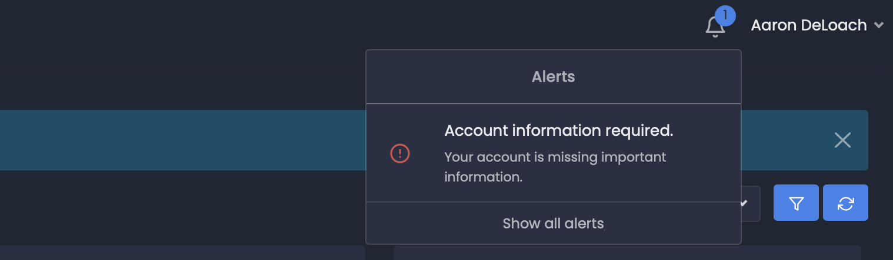

Alerts Plus
===========

A PHP package for incorporating highly configurable alert system into your application.

* Framework or vanilla PHP environments
* No database requirements
* Extendable
* Injection of HTML templates from any source
* Provides for HTML and configuration Separation of Concerns (SoC)
* Custom configuration values can be processed for each alert (i.e. access control)
* Alerts can be prioritized
* Optional message can be provided for each alert




Installation
------------

If you haven't already done so, store your customer number and access token in the global composer auth.json.

```bash
composer config --global --auth http-basic.deloachtech.repo.packagist.com your-customer-number your-access-token
```

Add your customer number to the projects `composer.json` file.

```json
"repositories": [
    {"type": "composer", "url": "https://deloachtech.repo.packagist.com/your-customer-number/"}
]
```

If your customer account has access to this package, continue with the installation.


```bash
composer require aarondeloach/alerts-plus
```


Usage
-----

> The sample code provided uses simple procedural logic. The package can be incorporated into any framework or architectural pattern.

### Setup

Create an alert HTML class that extends the `AlertHTMLInterface` and implements its methods. This class will provide the HTML used to generate the alerts list.


```php
// App\AlertHTML.php

use DeLoachTech\AlertsPlus\AlertsHTMLInterface;

class AlertsHTML extends AlertsHTMLInterface
{
    // Implement the interface methods ...
}
```

> You can use the [example](https://github.com/deloachtech/alerts-plus/blob/main/example/AlertsHTML.php) provided to get started.


### Managing Alerts

Create a class for managing alerts that extends the `AbstractAlertManager` and implement its methods.

> If you're upgrading from the `deloachtech/alerts` package you can use your existing manager. Simply move the alertsHTML() method to the HTML class you created above.

```php
// App\AlertManager.php

namespace App;

use DeLoachTech\AlertsPlus\AbstractAlertManager;

class AlertManager extends AbstractAlertManager
{
    // Implement the interface methods ...
}
```

Create a configuration of alerts to provide the alert manager. The array keys are the FQCN of the alert class. The array values are any data you want passed back to the alert for processing.

> If you're upgrading from the `deloachtech/alerts` package you can use your existing configuration. Simply add an array to the existing keys as needed for processing extra values.

```php
// config\alerts.php

return [
    // ...
    'App\FooBarAlert',
    'App\AccountInfoRequiredAlert' => [
         // Provide anything you want to validate/process in the alert.
        'role' => 'SuperUser'
    ]
    // ...
];
```

> You can use the [examples](https://github.com/deloachtech/alerts-plus/tree/main/example) provided to get started.


### Creating Alerts

Create a class for each alert that implements the `AlertInterface` and its methods. Activate the alert in the configuration that's passed to the manager.

> If you're upgrading from the `deloachtech/alerts` package you can use your existing alerts. Simply change the referenced `DeLoachTech\Alerts\AlertInterface` to the new `DeLoachTech\AlertsPlus\AlertInterface` and implement the two new methods.

```php
// App\AccountInfoRequiredAlert.php

namespace App;

use DeLoachTech\AlertsPlus\AlertInterface;

class AccountInfoRequiredAlert extends AlertInterface
{
    // Implement the interface methods ...    
}
```


### Displaying Alerts

Somewhere in you HTML layer:

```php
// dashboard.php

namespace App;

// ...

echo (new AlertManager())->getAlerts(new AlertHTML());
```

Upgrading from a previous version
---------------------------------

If you've upgraded form the `deloachtech/alerts` package, here are some changes to make for a quick start.

1. Remove the `deloachtech/alerts` package.
2. Use your existing alert manager by moving the alertsHTML() method to the HTML class you created above.
3. Use your existing configuration by adding an array to the existing keys as needed for processing extra values.
4. Replace any `use DeLoachTech\Alerts\...` with `use DeLoachTech\AlertsPlus\...`
5. Add the new alert HTML class you created to any existing `->getAlerts()` method calls (i.e. `->getAlerts(new MyNewAlertHTMLClass())`).


